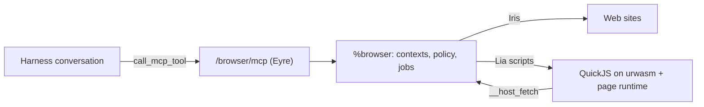

# urbit-browser

A headless web browser that runs entirely on an Urbit ship, as the Gall
agent `%browser`, and exposes itself to model clients as an MCP server.
It was built for the [urbit-agent-harness](../urbit-agent-harness), which
registers remote MCP servers and grants them per conversation.

No external process is involved. Pages are fetched with Iris, parsed and
scripted by a JavaScript page runtime running under QuickJS on urwasm, and
returned to the model as a text outline of the page with short element refs
that actions refer back to.



## What it can do

- Navigate to a URL, follow redirects, keep cookies, history and Web Storage
  per named browsing context; export a context's state as JSON and import it
  elsewhere.
- Run the page's own JavaScript: classic and ES module scripts (static and
  dynamic `import`, import maps), `fetch` and `XMLHttpRequest`, timers
  (virtual time), DOM mutation, events, custom elements, `localStorage`,
  `document.cookie`, `history.pushState`, `<meta http-equiv=refresh>`.
- Apply stylesheets for visibility: `<style>`, linked sheets, `@import`,
  media queries against the context's viewport, `!important`, so class-driven
  menus, modals and tabs show and hide the way a browser renders them.
- Return an accessibility-style outline: headings, text, links with resolved
  URLs, buttons, textboxes with values, checkboxes, selects with options,
  tables, lists and landmarks. Interactive elements get refs (`e7`).
- Click, type, select, press keys (Tab moves focus), hover, submit forms,
  attach files to file inputs; link clicks and form submissions become real
  navigations with the context's cookies.
- Read a page as markdown-like text, get its metadata (description, canonical
  URL, Open Graph, JSON-LD, dates, word count, headings), search the outline,
  list links, dump raw or cleaned HTML, evaluate expressions, wait for a
  selector or text to appear.
- Sign in with credentials the operator stored on the ship (`browser_login`
  fills the form; HTTP Basic challenges are answered automatically). Secrets
  never travel through MCP.
- Keep downloads (attachments and binary responses) per context, readable
  through `browser_files` or the `/browser/files/<ctx>/<name>` route.
- Record every navigation, subrequest, action, download and error per context
  (`browser_log`), and show it with the current outline on a live viewer page
  at `/browser/view`.
- Emulate a device per context: viewport size, mobile touch profile with a
  mobile user agent, locale (sent as `Accept-Language`), time zone.
- Block tracker and ad hosts and unwanted resource kinds, cache scripts and
  stylesheets across pages, and reuse one booted runtime for every page.
- Page every result under a byte budget so the harness's 8 KB result clip
  never truncates mid-line.

## What it does not do

These are deliberate non-goals, mostly because the browser runs entirely on
the ship with no rendering engine or Chromium process:

- No screenshots, PDFs or full-page captures: nothing is rasterised.
- No stealth or fingerprint injection, and no CAPTCHA solving. Anti-bot
  systems fingerprint a real rendering engine; a shim DOM will not pass them.
- No Chrome DevTools Protocol, WebSocket endpoint, or Puppeteer, Playwright
  and Selenium compatibility. The MCP tools are the whole API.
- No browser extensions, custom Chrome binaries or user data directories.
- No true forward proxy: Iris cannot tunnel, so a "proxy" is a gateway URL
  template that fetches the target on the ship's behalf.
- No WebAssembly inside pages, no Web Workers, no WebSockets or
  Server-Sent Events, no IndexedDB, no `crypto.subtle`, no canvas or media
  playback. These APIs exist as stubs that fail cleanly.
- Layout is not computed: elements have zero size and position, and only
  `display` and `visibility` are taken from stylesheets. Content hidden by
  size, overflow or positioning still appears in outlines.
- JavaScript runs slowly (interpreted QuickJS inside an interpreted wasm), so
  script-heavy applications may hit the CPU or script budgets; those pages
  can still be read with `js=false`.
- Binary uploads are not supported; `browser_upload` sends text content.
- Non-UTF-8 pages other than Latin-1 and Windows-1252 are not transcoded.
- DNS rebinding is not detected: the private-host policy checks names and
  literal addresses, not resolved addresses.

## Build and install

Requirements: a ship on `[%zuse 408]`, Vere with the urwasm jets (4.6 or
newer), Node 18+ (to bundle the runtime), and Zig 0.14 or newer for
`zig build` (optional; `scripts/install.sh` does the same with rsync).

```text
|new-desk %browser
|mount %browser
```

```sh
zig build -Ddesk=~/path/to/pier/browser     # or: scripts/install.sh ~/path/to/pier/browser
```

```text
|commit %browser
|install our %browser
```

The desk ships a Landscape tile (`desk.docket-0`): "Browser" opens the live
viewer at `/browser/view`, which lists contexts and shows each one's current
outline, downloads and recording. The tile icon is served by the agent at
`/browser/icon.svg`.

Read the API key the agent generated:

```text
.^(json %gx /=browser=/key/json)
```

or over HTTP with an authenticated session: `GET /~/scry/browser/key.json`.

## Connect the harness

In the harness, Settings → MCP → add a server:

| Field | Value |
| --- | --- |
| URL | `http://localhost:8080/browser/mcp` (your ship's HTTP port) |
| Header | `x-api-key: <key>` |

Then grant it in a conversation's tools with `{"mcp":"<server-id>"}`. The
model discovers the tools with `list_mcp_tools` and calls them with
`call_mcp_tool`. Any other MCP client that speaks stateless Streamable HTTP
(POST JSON-RPC, JSON responses) works the same way. The endpoint accepts either
the key header, `Authorization: Bearer <key>`, or an authenticated Eyre
session cookie.

## Tools

| Tool | Purpose |
| --- | --- |
| `browser_navigate` | Open a URL, return the outline (page 1) |
| `browser_snapshot` | Re-read the outline, `page=N` for more |
| `browser_click`, `browser_type`, `browser_select`, `browser_press`, `browser_hover`, `browser_submit` | Act on refs; navigations follow automatically |
| `browser_login` | Fill and submit a login form with an operator-stored credential |
| `browser_upload` | Attach an inline text file to a file input |
| `browser_text` | Readable text of the page or an element, paged |
| `browser_metadata` | Title, description, canonical, Open Graph, JSON-LD, dates, counts |
| `browser_find`, `browser_links`, `browser_html` | Search, link listing, raw or cleaned HTML |
| `browser_eval` | Evaluate JavaScript in the page |
| `browser_wait` | Let timers run, optionally until a selector or text appears |
| `browser_back` | Back or forward through the context's history |
| `browser_files` | List, read or delete a context's downloads |
| `browser_log` | The context's recording, newest first |
| `browser_contexts` | List, close, clear cookies, export, import, configure device/timeout/proxy |

Every tool takes an optional `context` name; the harness forwards no
conversation identity, so the model names its own context (default
`"default"`). Contexts isolate cookies, history, storage, downloads and device
profile. Idle contexts expire; at most `max-live` contexts keep a live
JavaScript runtime, others keep their last outline and re-navigate on the next
action.

## Operator pokes

`%browser-action` (JSON) or `%noun` pokes, ship owner only:

```text
:browser &browser-action [%set-credential origin='https://example.com' username='me' password='secret']
:browser &browser-action [%del-credential 'https://example.com']
:browser &browser-action [%set-proxy 'ctx' `'http://gw.local:8080/fetch?u={url}']
:browser &browser-action [%rotate-key ~]
:browser &browser-action [%clear-cache ~]
:browser &browser-action [%close-all ~]
```

Credentials are keyed by origin and used only by `browser_login` and HTTP
Basic challenges; `/x/credentials` lists origins, never secrets. A proxy is a
gateway template: Iris cannot tunnel through a forward proxy, so the target
URL is substituted into `{url}` and the gateway is asked to fetch it.

## Policy

`%set-policy` replaces the whole policy. Defaults: no allow list, no deny
list, private and loopback hosts blocked, a built-in block list of analytics
and ad hosts, `beacon` requests dropped, 1 MiB body cap, 10 redirects,
JavaScript and CSS on with a 10 s CPU budget per engine step (`%jinx`),
512 KiB of external script and 512 KiB of stylesheet per page, 40 subrequests
per tool call, script cache of 8 MiB with a 1 h TTL, 8 MiB of downloads and
200 recorded events per context, 5000-byte result pages, 16 contexts, 4 live
runtimes, 6 h idle expiry, 2 min per tool call.

Because Iris resolves DNS itself, the private-host check inspects host names
and literal addresses, not resolved addresses. Put the ship behind an egress
policy if that matters.

## Layout

```text
desk/app/browser.hoon        agent: Eyre/MCP endpoint, contexts, jobs, Iris, policy
desk/lib/browser-js.hoon     Lia scripts driving QuickJS: boot, load, act, query
desk/lib/browser-mcp.hoon    tool catalog, JSON-RPC envelopes, paging
desk/lib/browser-cookie.hoon cookie jar (Set-Cookie parsing, matching)
desk/lib/browser-url.hoon    URL splitting/resolution, host policy
desk/sur/browser.hoon        types
desk/desk.docket-0           Landscape tile (opens the viewer page)
desk/lib/browser-icon.hoon   tile icon (SVG), served at /browser/icon.svg
desk/js/browser-runtime.js   generated page runtime (from js/src/*.js)
js/src/                      HTML parser, DOM, selectors, forms, window, CSS cascade, ES modules, snapshot
desk/lib/wasm, desk/sur/wasm urwasm (vendored, [%zuse 408])
desk/quick-js-emcc.wasm      QuickJS (quickjs-emscripten build)
scripts/runtime-check.mjs    Node tests for the page runtime against fixtures
scripts/mcp-conformance.mjs  end-to-end test against a running ship
scripts/install.sh           rsync the desk into a mount (+ optional dojo commit)
scripts/dojo.sh              run one dojo command in a tmux session, print its output
```

## Development

```sh
node scripts/build-runtime.mjs        # bundle js/src -> desk/js/browser-runtime.js
node scripts/runtime-check.mjs        # runtime tests (no ship needed)
node scripts/runtime-check.mjs page.html   # print the outline of any HTML file
SHIP_URL=http://localhost:8093 SHIP_CODE=... node scripts/mcp-conformance.mjs
```

The conformance script talks to the endpoint exactly the way the harness's
`call_mcp_tool` does (a stateless POST with the configured header, a JSON
body, a JSON response), so a passing run means the harness can use it; the
registration itself is done in the harness UI as described above.

## Performance notes

- Static or server-rendered pages take well under a second; a Wikipedia
  article with scripts on takes about 6 s, with `js=false` under 2 s. Sites
  that ship hundreds of kilobytes of client JavaScript (Next.js apps) spend
  10 to 20 s executing it under QuickJS on urwasm; lower `max-script-bytes`
  or pass `js=false` when the content is server-rendered anyway.
- After a page is loaded, actions and queries cost 0.1 to 0.6 s because the
  Lia runtime is driven with the `%gent` hint, which keeps the jet's wasm3
  machine cached across events. With the Spider convention (`%rand`) every
  step would replay the page's whole history; the agent frees a cached
  machine with an `%oust` no-op when it drops a runtime.
- Scripts and stylesheets are cached across pages (`cache-ttl`), and tracker
  hosts on the block list are never fetched.

The runtime is deterministic: `Math.random`, `Date` and timers are driven by
values the ship supplies, so the Lia script that produced a page can be
replayed from its recorded host results.
